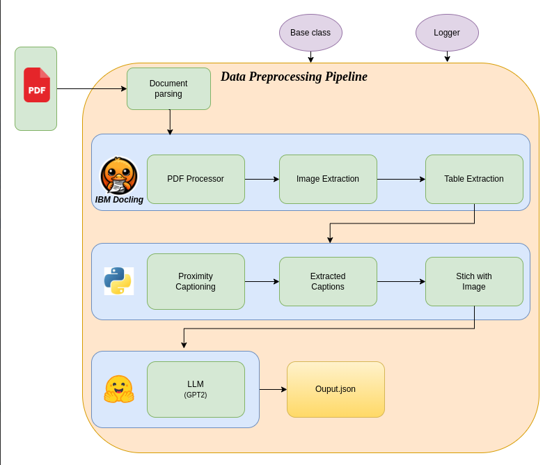

# BrahmDAX: Advanced Document Analysis & Extraction Pipeline

[](https://opensource.org/licenses/MIT)
[](https://www.python.org/downloads/release/python-3100/)
[](https://github.com/IBM/docling)
[](https://github.com/zenteiq-ai/BrahmDAX)
[](https://huggingface.co/)
[](https://huggingface.co/gpt2)
[](https://docs.python.org/3/library/logging.html)
## Table of Contents
- [Overview](#overview)
- [Architecture](#architecture)
- [Core Components](#core-components)
- [Technical Features](#technical-features)
- [Project Structure](#project-structure)
- [Installation](#installation)
- [Configuration](#configuration)
- [Usage](#usage)
- [Component Specifications](#component-specifications)
- [Output Schema](#output-schema)
- [Logging System](#logging-system)
- [Extending the Pipeline](#extending-the-pipeline)
- [Additional Resources](#additional-resources)

## Overview

BrahmDAX is a document processing pipeline built on IBM's Docling framework that extracts images and tables from PDFs while providing enhanced captioning through LLM models. By using proximity-based analysis to locate captions and enriching them with language models, our pipeline transforms documents into LLM-readable and LLM-understandable formats. This approach enables large-scale document analysis and content extraction through a modular architecture of specialized processors, ultimately making any PDF accessible for AI consumption and processing.


## Architecture




### Core Capabilities
- Document structure analysis and metadata extraction
- Coordinate-aware image extraction with proximity-based caption detection
- LLM-enhanced caption enrichment using fine-tuned GPT-2
- Table structure preservation and multi-format export

## Architecture

BrahmDAX implements a multi-stage processing pipeline with modular components following the processor pattern:

```
Input Documents → PdfProcessor → {ProximityCaptioner, TableProcessor} → LLMEnricher → Structured JSON Output
```

Each component in the pipeline operates on the document independently, with results aggregated through a coordination layer that maintains document context across processing stages.

## Core Components

### PdfProcessor
Handles initial document parsing and structural analysis using Docling's PDF engine.

### ProximityCaptioner
Advanced caption extraction system that:
- Identifies image bounding box coordinates within document space
- Conducts spatial proximity search for text patterns (e.g., "FIG", "FIGURE")
- Extracts complete caption text using contextual boundary detection
- Preserves coordinate-caption relationships

### TableProcessor
Specialized table extraction with structure preservation capabilities.

### LLMEnricher
Caption enhancement subsystem that:
- Processes proximity-extracted captions through fine-tuned GPT-2
- Enriches caption content with contextual understanding
- Generates additional fields including `image_description`, `key_insights`, and `mathematical_context`
- Maintains semantic consistency with original caption

## Technical Features

- **Asynchronous Multi-threading**: ThreadPoolExecutor-based parallel processing
- **Context-Aware Processing**: Spatial coordinate system for relating document elements
- **Pipeline Pattern**: Modular component design with standardized interfaces
- **Instrumented Logging**: Comprehensive tracing across all processing stages
- **Error Resilience**: Graceful failure handling with detailed diagnostics

## Project Structure

```
├── data/                      # Input document storage
├── env/                       # Environment configuration
├── notebooks/
│   ├── docling_parsing.ipynb  # Docling implementation examples
│   ├── try_rag.ipynb          # RAG integration examples
├── output/
│   └── {document_name}/
│       ├── images/            # Extracted images
│       ├── tables/            # Extracted tables
│       └── final_output.json  # Structured extraction results
├── pipeline/
│   ├── base.py                # Abstract processor definitions
│   ├── document_processing.py # Document orchestration
│   ├── image_processing.py    # Image extraction & captioning
│   ├── logger.py              # Logging subsystem
│   ├── pdf_processing.py      # PDF parsing
│   ├── table_processing.py    # Table extraction
│   └── __init__.py
├── .env                       # Environment variables
├── .gitignore
├── data_preprocessing.py      # Preprocessing utilities
├── main.py                    # Execution entry point
├── pipeline.log               # System logs
├── README.md
└── requirements.txt           # Dependencies
```

## Installation

1. **Clone Repository**
```bash
git clone https://github.com/zenteiq-ai/BrahmDAX.git
cd BrahmDAX
```

2. **Configure Environment**
```bash
# Create virtual environment
python -m venv env

# Activate environment
# On Windows:
env\Scripts\activate
# On Unix/MacOS:
source env/bin/activate

# Install dependencies
pip install -r requirements.txt
```

3. **Verify Installation**
```bash
python main.py --test
```

## Configuration

Create a `.env` file in the root directory with the following parameters:

```ini
# Processing Configuration
BATCH_SIZE=10
USE_GPU=True
CONCURRENT_THREADS=4

# Logging Configuration
LOG_LEVEL=INFO
LOG_FORMAT=detailed

# Model Configuration
CAPTIONER_MODEL_PATH=./models/gpt2_captioner.pt
PROXIMITY_SEARCH_RADIUS=100
TABLE_DETECTION_THRESHOLD=0.85
```

## Usage

### Overall pipeline Execution
```
python main.py
```
### Basic Execution
```bash
python main.py --input_dir ./data --output_dir ./output
```

### Processing Specific Files
```bash
python main.py --files paper1.pdf,paper2.pdf
```

### Component-Specific Processing
```bash
python main.py --components PdfProcessor,ProximityCaptioner
```

## Component Specifications

### ProximityCaptioner

The `ProximityCaptioner` implements a spatial-aware algorithm for identifying image captions:

1. Extracts image coordinates from document space (`x1, y1, x2, y2`)
2. Searches for caption indicators ("FIG", "FIGURE") within proximity radius
3. Determines caption boundaries using natural language processing
4. Maps coordinates to extracted caption text

Configuration parameters:
- `PROXIMITY_SEARCH_RADIUS`: Pixel distance for caption search (default: 100px)
- `CAPTION_PATTERNS`: Regex patterns for caption identification
- `BOUNDARY_DETECTION_METHOD`: Algorithm for caption boundary detection

```python
# Usage example
captioner = ProximityCaptioner(config={'search_radius': 150})
captions = captioner.process(document)
```

### LLMEnricher

The `LLMEnricher` leverages fine-tuned GPT-2 to enhance extracted captions:

1. Pre-processes raw captions from proximity detection
2. Generates enriched descriptions with specialized knowledge
3. Extracts key insights and mathematical context
4. Structures output in standardized JSON format

Configuration parameters:
- `MODEL_PATH`: Path to fine-tuned GPT-2 model
- `BATCH_SIZE`: Number of captions to process in parallel
- `OUTPUT_FIELDS`: Configurable output field structure

## Output Schema

The system generates structured JSON output for each document:

```json
"image_id": 8,
"page": 11,
"coordinates": [301.18, 716.36, 521.95, 607.90],
"data": {
"image_description": "FIG. 8: E2-maps for 52 Mn, 69 Co, and 70 Co...",
"image_caption": "Figure 8 shows the model for 53 Mn and 69 Co...",
"key_insights": "The K E = M (2) = 3 2, and the M = (3) 2...",
"mathematical_context": "The figure shown here is a model of..."
}
```

## Logging System

BrahmDAX implements a comprehensive logging system with detailed traceability:

```
2025-02-28 10:07:09,270 - INFO - Initialized PdfProcessor component with config: {}
2025-02-28 10:07:09,270 - INFO - Initialized ProximityCaptioner component with config: {}
2025-02-28 10:07:09,270 - INFO - Initialized TableProcessor component with config: {}
2025-02-28 10:07:09,270 - INFO - Initialized LLMEnricher component with config: {}
2025-02-28 10:07:31,263 - INFO - Processing PictureItem 2
2025-02-28 10:07:31,263 - INFO - Image 2 on page 2
2025-02-28 10:07:31,263 - INFO - Location: 301.18, 716.36, 521.95, 607.90
2025-02-28 10:07:31,264 - INFO - Caption: Figure 1: A random network of cliques...
2025-02-28 10:09:30,759 - INFO - Final output saved to ./output/paper/final_output.json
2025-02-28 10:09:30,759 - INFO - Finished processing paper.pdf. Extracted 21 images and 1 table.
```

## Extending the Pipeline

BrahmDAX is designed to be easily extended with new features through its modular architecture. Here's how you can add your own custom components:

### Adding a Custom Processor

Want to add a new capability to BrahmDAX? For example, let's say you want to add a processor that identifies and extracts mathematical equations from documents:

1. **Create a new Python file** in the `pipeline` folder (e.g., `equation_processor.py`)

2. **Write your processor class** using this template:

```python
from pipeline.base import BaseProcessor

class EquationProcessor(BaseProcessor):
    """Processor that extracts mathematical equations from documents."""
    
    def __init__(self, config=None):
        # Set up your processor with any configuration it needs
        super().__init__(config or {})
        self.logger.info("Initialized EquationProcessor")
    
    def process(self, document):
        # Your code to extract equations goes here
        self.logger.info(f"Processing equations in document: {document.name}")
        
        # Example processing logic:
        equations = []
        for page in document.pages:
            # Find equations on the page
            page_equations = self._find_equations(page)
            equations.extend(page_equations)
            
        # Add the results to the document
        document.equations = equations
        return document
    
    def _find_equations(self, page):
        # Helper method to find equations on a page
        # Your equation detection logic goes here
        return []
```

3. **Add your processor to the pipeline** in `main.py`:

```python
from pipeline.pdf_processing import PdfProcessor
from pipeline.image_processing import ProximityCaptioner
from pipeline.equation_processor import EquationProcessor  # Import your new processor

# Set up the pipeline with your new processor
processors = [
    PdfProcessor(),
    ProximityCaptioner(),
    EquationProcessor(config={'detection_threshold': 0.8}),  # Add your processor with any config
    # ... other processors
]

# Run the pipeline as usual
for document in documents:
    for processor in processors:
        document = processor.process(document)
```

### Common Extension Types

The BrahmDAX pipeline can be extended in many ways:


- **Enrichers**: Add additional analysis or context to extracted content
- **Formatters**: Create new output formats for specific use cases
- **Post-processors**: Clean up or standardize extracted content
- **Analyzers**: Gather statistics or insights about document content

Each processor follows the same simple pattern:
1. Take a document as input
2. Process it according to its specific function
3. Return the modified document

This makes it easy to add, remove, or rearrange processors in our pipeline to suit your specific needs.

## Additional Resources

- **Notebooks**:
  - `docling_parsing.ipynb`: Detailed examples of Docling integration
  - `try_rag.ipynb`: Example RAG implementation with BrahmDAX outputs
